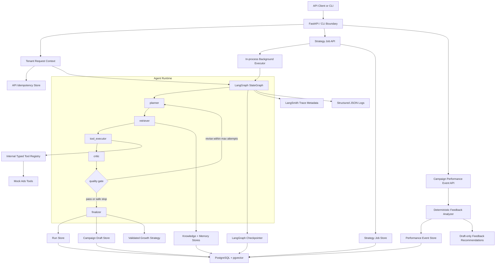
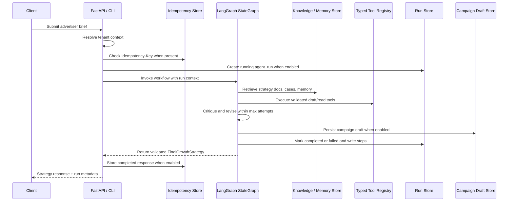
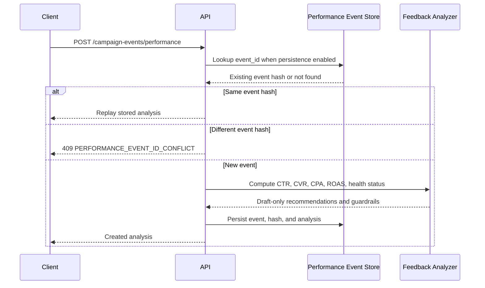
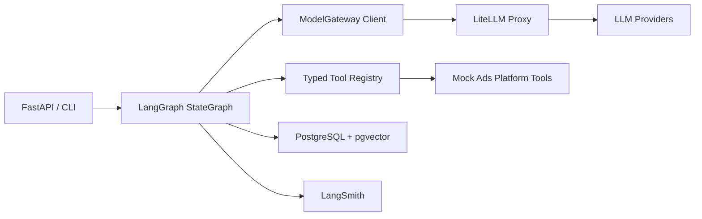

# RFC v0.1: Autonomous Ads Growth Agent Platform

## 1. Document Status

| Field | Value |
|---|---|
| Product | Autonomous Ads Growth Agent Platform |
| Chinese Name | 广告增长智能 Agent 平台 |
| Document Type | Product RFC / High-Level Design |
| Status | Draft for architecture review |
| Decision Needed | Approve v0.1 product scope, system architecture, and launch gates |
| DRI | TBD |
| Reviewers | Product, Ads Engineering, ML Platform, Data Engineering, Privacy/Safety, LLMOps |
| Audience | Product, Engineering, ML/LLMOps, Data, Ads Platform, Leadership |
| Last Updated | 2026-05-18 |

### 1.1 Review Protocol

| Item | Standard |
|---|---|
| Review Type | High-level product and architecture review |
| Expected Outcome | Approve, approve with changes, or reject with required follow-up |
| Required Approvers | Product DRI, Engineering DRI, ML/LLMOps DRI |
| Required Consulted Teams | Ads Platform, Data, Privacy/Safety |
| Decision Artifacts | RFC, architecture diagram, requirement tables, evaluation plan, launch checklist |
| Change Control | Any P0 scope, data boundary, or agent autonomy change requires RFC update |

### 1.2 RACI

| Area | Responsible | Accountable | Consulted | Informed |
|---|---|---|---|---|
| Product scope | Product DRI | Product Lead | Engineering, Ads Platform | Leadership |
| Agent architecture | Engineering DRI | Engineering Lead | ML Platform, LLMOps | Product |
| Evaluation framework | LLMOps DRI | ML Platform Lead | Data, Product | Engineering |
| Data and RAG sources | Data DRI | Data Lead | Ads Platform, Privacy/Safety | Engineering |
| Safety and policy review | Safety DRI | Safety Lead | Product, Legal/Policy | Leadership |
| Launch readiness | Engineering DRI | Engineering Lead | Product, LLMOps | Leadership |

### 1.3 Engineering Change Workflow

This workflow is the v0.1 engineering standard. GitHub Actions quality gates, dependency locking, deterministic end-to-end smoke coverage, and release-readiness checks are implemented in the repository. Branch protection remains a GitHub repository setting and must be configured before a collaborative launch readiness claim; for the current private repository, GitHub returned `403` because branch protection requires GitHub Pro or a public repository.

| Item | Standard |
|---|---|
| Version control | GitHub repository with a stable `main` branch |
| Branch strategy | Keep `main` stable; use `feature/*` or `codex/*` branches for implementation work |
| Pull requests | Require a PR for non-trivial changes and at least one approval before merge once collaboration begins |
| Required checks | Require automated lint, unit tests, deterministic end-to-end smoke tests, and selected integration tests before merge |
| Release discipline | Use semantic version tags and release notes for demo or release milestones |
| Exceptions | Engineering DRI documents and approves any temporary bypass of review or CI requirements |

## 2. Executive Summary

This product is an AI Agent-powered growth platform for advertisers. It helps advertisers convert a high-level business goal, such as increasing app registrations within a fixed budget, into an executable campaign strategy across audience, creative, bidding, budget, measurement, and optimization.

The platform uses multi-agent orchestration, tool calling, RAG, advertiser memory, structured outputs, self-reflection, and LLMOps observability to produce reliable and traceable campaign recommendations.

The v0.1 decision is to build a controlled agentic campaign planning system that creates drafts and recommendations only. It will not execute live ad spend or modify production campaigns without human approval.

## 3. Problem Statement

Advertisers often know their business goal but struggle to translate it into a complete and optimized advertising strategy. Campaign setup requires expertise across audience selection, creative direction, budget allocation, bidding, measurement, and post-launch optimization. These steps are fragmented, manual, and hard to continuously improve.

The product aims to create an autonomous agent workflow that can reason over advertiser goals, retrieve relevant campaign knowledge, use platform tools, generate structured actions, evaluate its own output, and improve recommendations based on feedback.

## 4. Goals

| Goal ID | Goal | Success Signal |
|---|---|---|
| G1 | Convert natural language advertiser goals into structured campaign briefs | The system extracts objective, budget, product, KPI, target market, constraints, and missing information |
| G2 | Generate actionable growth strategies | The output includes audience, creative, budget, bidding, measurement, and risk sections |
| G3 | Support agentic planning and tool execution | The system can decompose tasks, route work to specialist agents, and call mock advertising tools |
| G4 | Ground recommendations in knowledge and data | The system retrieves campaign best practices, platform policy, and historical cases |
| G5 | Improve output quality through critique loops | A critic agent scores strategy quality and triggers revision when needed |
| G6 | Provide production-style observability | LangSmith traces, evaluation datasets, and run metadata are available for debugging and monitoring |

### 4.1 Decision Drivers

| Driver | Why It Matters |
|---|---|
| Agent reliability | The system must produce consistent, inspectable plans instead of opaque one-shot answers |
| Grounding | Campaign recommendations must be tied to retrieved knowledge, tool outputs, or clearly marked assumptions |
| Safety | The system must avoid unsafe creative claims, policy violations, and unapproved campaign execution |
| Extensibility | The architecture should allow new agents, tools, data sources, and evals without rewriting the core workflow |
| Portfolio credibility | The project should demonstrate real product engineering depth, not just a chatbot wrapper |

## 5. Non-Goals

| Non-Goal ID | Non-Goal |
|---|---|
| NG1 | Direct integration with a real TikTok Ads API in v0.1 |
| NG2 | Real-time campaign spending or live bidding changes in v0.1 |
| NG3 | Full UI dashboard in the first iteration |
| NG4 | Training or fine-tuning a custom foundation model |
| NG5 | Guaranteeing real advertising performance lift from simulated data |

## 6. Target Users

| User Type | Need |
|---|---|
| Small and mid-market advertiser | Wants a clear campaign plan without deep ads expertise |
| Growth marketer | Wants faster strategy generation and optimization ideas |
| Ads platform operator | Wants safer, more consistent AI-generated campaign recommendations |
| Internal ML/LLMOps engineer | Wants traceable, evaluable, and monitorable agent behavior |

## 7. Primary User Journey

1. Advertiser enters a goal, budget, product description, and KPI.
2. Intake Agent extracts a structured advertiser brief and identifies missing fields.
3. Planner Agent decomposes the goal into specialist tasks.
4. Supervisor routes tasks to Audience, Creative, Budget, and Performance agents.
5. Agents retrieve relevant knowledge and call advertising tools.
6. System assembles an initial campaign strategy.
7. Critic Agent evaluates completeness, feasibility, policy risk, budget consistency, and actionability.
8. If the quality score is below threshold, the system revises the plan.
9. Final output is returned as structured strategy, recommended actions, assumptions, and risks.
10. LangSmith records traces, tool calls, state transitions, evaluation scores, and errors.

## 8. Functional Requirements

### 8.0 Priority Definitions

| Priority | Definition |
|---|---|
| P0 | Required for v0.1 architecture review and first end-to-end demo |
| P1 | Required before a credible beta-style demo |
| P2 | Future enhancement that should not block v0.1 |

### 8.1 Advertiser Intake

| ID | Requirement | Priority | Acceptance Criteria |
|---|---|---|---|
| FR-1 | Parse advertiser free-text input into a structured brief | P0 | Extracts product, objective, budget, KPI, target geography, timeline, and constraints |
| FR-2 | Detect missing or ambiguous campaign information | P0 | Produces a list of missing fields and safe assumptions |
| FR-3 | Normalize business goals into supported campaign objectives | P0 | Maps goals to objectives such as app install, registration, purchase, traffic, or lead generation |

### 8.2 Planning and Orchestration

| ID | Requirement | Priority | Acceptance Criteria |
|---|---|---|---|
| FR-4 | Generate a task plan using Plan-and-Execute workflow | P0 | Produces ordered tasks with owners, inputs, expected outputs, and dependencies |
| FR-5 | Route tasks to role-specific agents | P0 | Supervisor can route audience, creative, budget, and performance tasks to the correct agent |
| FR-6 | Maintain shared workflow state | P0 | State includes brief, retrieved context, intermediate outputs, tool results, critique report, and final strategy |
| FR-7 | Support event-driven re-analysis | P1 | A campaign performance event can trigger analysis and revised recommendations |

### 8.3 Specialist Agents

| ID | Requirement | Priority | Acceptance Criteria |
|---|---|---|---|
| FR-8 | Audience Strategist recommends target segments | P0 | Output includes audience rationale, exclusions, and confidence |
| FR-9 | Creative Strategist generates creative brief | P0 | Output includes messaging angles, format suggestions, hooks, and policy risks |
| FR-10 | Budget Optimizer recommends budget and bidding strategy | P0 | Output respects total budget and includes allocation rationale |
| FR-11 | Performance Analyst interprets historical or simulated performance data | P0 | Output identifies performance drivers, risks, and optimization opportunities |
| FR-12 | Critic Agent evaluates and revises strategy quality | P0 | Produces scores, issues, recommendations, and pass/fail decision |

### 8.4 Tool Use

| ID | Requirement | Priority | Acceptance Criteria |
|---|---|---|---|
| FR-13 | Provide mock campaign draft tool | P0 | Creates a structured campaign draft object |
| FR-14 | Provide audience recommendation tool | P0 | Returns recommended segments and estimated fit |
| FR-15 | Provide creative brief generation tool | P0 | Returns structured creative concepts and constraints |
| FR-16 | Provide budget allocation tool | P0 | Returns budget split by campaign phase or audience |
| FR-17 | Provide performance analytics tool | P0 | Returns metrics such as CPA, CVR, CTR, spend, and conversion trend |
| FR-18 | Handle tool errors and retries | P1 | Failed tool calls are captured with retry or fallback behavior |

### 8.5 RAG and Knowledge Retrieval

| ID | Requirement | Priority | Acceptance Criteria |
|---|---|---|---|
| FR-19 | Retrieve campaign strategy documents | P0 | Agents can cite retrieved best practices or campaign cases |
| FR-20 | Retrieve policy and creative safety guidance | P0 | Creative output includes policy-aware risks and constraints |
| FR-21 | Retrieve historical campaign cases | P1 | Recommendations can reference similar campaign examples |
| FR-22 | Track retrieved sources in final output | P1 | Final strategy includes source IDs or document references |

### 8.6 Memory

| ID | Requirement | Priority | Acceptance Criteria |
|---|---|---|---|
| FR-23 | Maintain short-term workflow memory | P0 | Current run state is available across agents |
| FR-24 | Maintain advertiser profile memory | P1 | Repeated advertiser sessions can reuse product, audience, and brand context |
| FR-25 | Summarize campaign history | P1 | Prior campaign results are compressed into reusable summaries |

### 8.7 Structured Output

| ID | Requirement | Priority | Acceptance Criteria |
|---|---|---|---|
| FR-26 | Return final strategy using a strict schema | P0 | Output validates against Pydantic schema |
| FR-27 | Include recommended actions | P0 | Actions include type, owner, parameters, expected impact, and risk |
| FR-28 | Include assumptions and risks | P0 | Final output clearly separates facts, assumptions, and risks |

### 8.8 Observability and Evaluation

| ID | Requirement | Priority | Acceptance Criteria |
|---|---|---|---|
| FR-29 | Trace agent runs in LangSmith | P0 | Each run includes graph state, tool calls, prompts, outputs, and errors |
| FR-30 | Evaluate plan quality | P1 | Evaluation covers completeness, actionability, budget consistency, and grounding |
| FR-31 | Monitor run-level failures | P1 | Tool failures, schema failures, and low critic scores are logged |

## 9. Non-Functional Requirements

### 9.1 Reliability and Fault Tolerance

| ID | Requirement | Priority | Target |
|---|---|---|---|
| NFR-1 | Workflow state must be recoverable | P0 | Use checkpointing for graph execution |
| NFR-2 | Tool failures must not crash the full run | P0 | Return structured errors and fallback recommendations |
| NFR-3 | Structured output must be validated | P0 | Invalid outputs trigger repair or retry |
| NFR-4 | The system must avoid infinite revision loops | P0 | Set max revision count and expose failure reason |

### 9.2 Quality and Correctness

| ID | Requirement | Priority | Target |
|---|---|---|---|
| NFR-5 | Recommendations must be grounded in retrieved context or tool results | P0 | Final output marks source-backed claims and assumptions |
| NFR-6 | Budget allocation must be internally consistent | P0 | Sum of allocated budget cannot exceed advertiser budget |
| NFR-7 | Critique scoring must be transparent | P1 | Each score includes rationale and improvement suggestion |

### 9.3 Performance

| ID | Requirement | Priority | Target |
|---|---|---|---|
| NFR-8 | v0.1 demo run should complete in acceptable time | P1 | Target under 60 seconds for one full workflow |
| NFR-9 | Retrieval latency should be bounded | P1 | Target under 3 seconds for PostgreSQL hybrid retrieval |
| NFR-10 | Tool simulation should be deterministic when seeded | P1 | Same input and seed should produce reproducible mock analytics |

### 9.4 Scalability

| ID | Requirement | Priority | Target |
|---|---|---|---|
| NFR-11 | Architecture should support adding new specialist agents | P1 | Add agent without rewriting core graph |
| NFR-12 | Tool layer should support real API adapters later | P1 | Mock tools use interfaces that can be replaced by API clients |
| NFR-13 | Knowledge layer should support more document types | P2 | Markdown and JSON in v0.1, extensible to warehouse or feature store |

### 9.5 Security, Privacy, and Safety

| ID | Requirement | Priority | Target |
|---|---|---|---|
| NFR-14 | Advertiser data should be separated by advertiser ID | P0 | Memory and traces include advertiser/session boundaries |
| NFR-15 | Sensitive input should not be exposed unnecessarily | P1 | Logs avoid raw secrets or credentials |
| NFR-16 | Creative recommendations should include policy risk checks | P0 | Policy-sensitive claims are flagged |
| NFR-17 | Autonomous actions should require confirmation in v0.1 | P0 | System creates drafts and recommendations, not live campaigns |
| NFR-30 | Product APIs should support an explicit local authentication boundary | P1 | Optional API key auth protects product endpoints while health probes remain public |

### 9.6 Observability and Operability

| ID | Requirement | Priority | Target |
|---|---|---|---|
| NFR-18 | Each agent decision should be traceable | P0 | LangSmith trace includes agent, input, output, and tool calls |
| NFR-19 | Run quality should be measurable over time | P1 | Evaluation scores can be compared across test cases |
| NFR-20 | Failures should be diagnosable | P1 | Errors include node name, tool name, state snapshot, and retry count |

### 9.7 Maintainability

| ID | Requirement | Priority | Target |
|---|---|---|---|
| NFR-21 | Schemas should be centralized | P0 | Pydantic models live in a shared schema module |
| NFR-22 | Prompts should be versioned | P1 | Agent prompts include version metadata |
| NFR-23 | Tests should cover high-risk logic | P1 | Unit tests for schemas, budget math, routing, and tool error handling |

### 9.8 Engineering Operations

| ID | Requirement | Priority | Target |
|---|---|---|---|
| NFR-24 | CI/CD quality gates should exist before launch readiness is claimed | P0 | GitHub Actions or equivalent runs lint, unit tests, and deterministic end-to-end smoke tests on every PR and push to `main` |
| NFR-25 | Dependency installs should be reproducible | P0 | A committed lock file pins direct and transitive dependencies for CI and demo installs |
| NFR-26 | The stable branch should be protected | P1 | `main` requires PR review and passing required checks before merge once the repository is shared |
| NFR-27 | End-to-end behavior should be tested through real application boundaries | P0 | At least one seeded workflow runs through the CLI or FastAPI path and validates final strategy, run metadata, and draft-only safety |
| NFR-28 | Release changes should be traceable | P1 | Version tags and release notes identify what changed, what was tested, and known limitations |
| NFR-29 | Dependency updates should be reviewed deliberately | P2 | Manual monthly dependency review for v0.1; Dependabot or Renovate can be introduced in v0.2+ |

### 9.9 SLIs and SLOs

| ID | Service Level Indicator | v0.1 Target | Measurement |
|---|---|---|---|
| SLO-1 | End-to-end valid run rate | >= 90% on curated eval set | LangSmith run result plus schema validation |
| SLO-2 | Structured output validation rate | >= 95% | Pydantic validation pass rate |
| SLO-3 | Tool failure containment rate | >= 95% | Failed tool calls that do not crash full workflow |
| SLO-4 | Budget consistency rate | 100% | Deterministic budget validator |
| SLO-5 | Grounded recommendation rate | >= 80% | Claims linked to RAG source, tool output, or explicit assumption |
| SLO-6 | Median demo workflow latency | <= 60 seconds | End-to-end wall-clock timing |
| SLO-7 | Trace coverage | 100% | Every workflow run has LangSmith trace ID |

### 9.10 Privacy, Safety, and Autonomy Guardrails

| Guardrail | v0.1 Policy |
|---|---|
| Human approval | The system may create campaign drafts and recommendations, but must not launch or modify live campaigns |
| Data boundary | Memory, traces, and retrieved context must be scoped by advertiser/session ID |
| Claims safety | Creative claims related to health, finance, employment, or sensitive categories must be flagged |
| Tool permissioning | Tools are divided into read, draft, and execute categories; v0.1 only allows read and draft tools |
| Trace hygiene | Logs should not contain credentials, API keys, or unnecessary raw sensitive data |
| Failure behavior | On low confidence, missing data, or policy risk, the system should ask for confirmation or return a safe fallback |

## 10. Proposed High-Level Architecture



### 10.1 Logical Components

| Component | Responsibility | Current v0.1 Implementation |
|---|---|---|
| Experience/API Layer | Accept advertiser requests, return strategy output, expose run and event APIs | FastAPI endpoints for strategy generation, run detail, retry, resume, and campaign performance events; CLI for demo, eval, and debugging |
| Request Context Layer | Resolve tenant scope and duplicate request behavior | `X-Tenant-ID` request override plus optional PostgreSQL idempotency key store |
| Orchestration Layer | Manage graph state, routing, checkpointing, and revision loop | LangGraph StateGraph with deterministic default nodes and optional Postgres checkpointer |
| Agent Layer | Perform role-specific planning, retrieval, tool execution, critique, and finalization | Implemented as explicit graph nodes: planner, retriever, tool_executor, critic, finalizer |
| LLM Gateway Layer | Provide multi-provider model access, retry, fallback, and future cost tracking | LiteLLM Proxy integration for opt-in LLM planner/critic and structured output repair |
| Tool Layer | Encapsulate advertising actions and analytics | Internal typed tool registry with Pydantic validation and draft-only mock ads tools |
| Knowledge Layer | Retrieve policy, strategy, and historical campaign context | In-memory default store plus optional PostgreSQL documents, pgvector columns, and retrieval events |
| Memory Layer | Store in-run and advertiser-level context | LangGraph state plus PostgreSQL-backed advertiser memory and optional graph checkpoints |
| Run Lifecycle Layer | Persist workflow executions for audit, debug, retry, and resume | Optional PostgreSQL `agent_runs` and `agent_run_steps` with running/completed/failed lifecycle |
| Async Job Layer | Accept long-running strategy requests and expose pollable status | `POST /growth-strategies/jobs`, `GET /growth-strategies/jobs/{job_id}`, in-process background executor, memory/Postgres job store |
| Feedback Loop Layer | Ingest campaign telemetry and return optimization recommendations | Performance event API, deterministic feedback analyzer, optional PostgreSQL persistence, and event-level idempotency |
| Evaluation Layer | Score output quality and workflow health | Local deterministic eval suite with LangSmith-compatible run metadata |
| Observability Layer | Trace decisions, tool calls, errors, and state transitions | LangSmith trace IDs plus structured JSON logs and persisted run/event records |

### 10.2 Interface Contracts

| Interface | Producer | Consumer | Contract |
|---|---|---|---|
| AdvertiserBrief | Intake Agent | Planner Agent | Structured objective, budget, KPI, product, constraints, missing fields |
| AgentTask | Planner Agent | Supervisor Router | Task type, owner, input payload, dependencies, expected output |
| ToolResult | Tool Layer | Specialist Agents | Success flag, payload, error, latency, source metadata |
| RetrievedContext | RAG Layer | Specialist Agents, Critic | Source ID, document type, snippet summary, relevance score |
| CritiqueReport | Critic Agent | Planner Agent, Finalizer | Quality score, issue list, required revisions, pass/fail |
| FinalGrowthStrategy | Finalizer | User/API, LangSmith | Validated strategy, actions, assumptions, risks, sources |
| RunMetadata | Orchestration Layer | API, CLI, persistence, observability | Run ID, execution ID, strategy ID, trace ID, node path, tool summaries |
| AgentRunDetailResponse | Run Store | API caller | Run status, persisted final strategy or error, metadata, and ordered step records |
| StrategyJobDetailResponse | Strategy Job Store | API caller | Job status, request, run ID, trace ID, completed strategy result, or structured failure |
| CampaignPerformanceEventRequest | API caller | Feedback Analyzer | Campaign metrics, objective, target CPA, attribution window, and event references |
| CampaignFeedbackAnalysis | Feedback Analyzer | API caller, Event Store | Derived metrics, health status, recommendations, guardrails, and source event ID |

### 10.3 Strategy Generation Sequence



### 10.4 Run Recovery and Campaign Feedback Sequences

```mermaid
sequenceDiagram
    participant Client
    participant API
    participant Runs as Run Store
    participant Graph as LangGraph + Checkpointer

    Client->>API: POST /runs/{run_id}/retry
    API->>Runs: Require original run status = failed
    API->>Graph: Start fresh execution under same strategy identity
    Graph-->>API: New run_id and strategy response

    Client->>API: POST /runs/{run_id}/resume
    API->>Runs: Reject completed run; load stored advertiser brief
    API->>Graph: Reuse same run_id and checkpoint thread when available
    Graph-->>API: Resumed strategy response
```



## 11. Technology Choices

### 11.1 Selected v0.1 Stack

| Layer | Selected Technology | Decision |
|---|---|---|
| Product API | FastAPI | Use FastAPI as the external API boundary for campaign strategy requests and responses |
| Local Demo | CLI | Provide a CLI for local end-to-end runs, eval execution, and debugging |
| Agent Runtime | LangGraph StateGraph | Use explicit graph nodes and state transitions instead of high-level agent loops |
| LLM Gateway | LiteLLM Proxy | Route model and embedding calls through an OpenAI-compatible multi-provider gateway |
| Tool Execution | Internal typed tool registry | Execute tools only after Pydantic validation and permission checks |
| Schema Layer | Pydantic v2 | Validate API payloads, tool input/output, critic reports, and final strategy objects |
| Graph State | TypedDict plus Pydantic boundaries | Keep LangGraph state lightweight while validating all external and durable boundaries |
| Database | PostgreSQL + pgvector | Use one data platform for business data, RAG documents, vectors, memory, and checkpoints |
| Data Access | SQLAlchemy 2 + Alembic | Use SQLAlchemy for database access and Alembic for schema migrations |
| Retrieval | pgvector + Postgres full-text search | Support hybrid search with metadata filtering and source attribution |
| Embeddings | LiteLLM-routed embedding provider | Use the same gateway strategy for embeddings and chat models |
| Observability | LangSmith + structured JSON logs | Use LangSmith for agent traces/evals and JSON logs for API, DB, and tool diagnostics |
| Local Packaging | Docker Compose | Start FastAPI, PostgreSQL with pgvector, and LiteLLM Proxy as a reproducible local stack |

### 11.2 Runtime Boundary

The product runtime separates the API boundary, orchestration runtime, model gateway, and tool execution layer.



The model is treated as a reasoning engine, not as the system authority. The LLM may propose structured intents, but the platform validates, authorizes, executes, and records all actions.

### 11.3 Structured Output and Tool Intent Fallback

| Step | Behavior |
|---|---|
| 1 | Prefer provider-native structured output when available through the gateway |
| 2 | Fall back to a JSON-schema prompt when the selected provider lacks native structured output |
| 3 | Validate every output with Pydantic before using it in graph state or tool execution |
| 4 | On invalid JSON or schema mismatch, trigger a repair prompt and retry within a bounded retry policy |
| 5 | If repair fails, return a safe failure and do not execute tool actions |

### 11.4 PostgreSQL Data Boundaries

| Data Domain | Storage Responsibility | Isolation Rule |
|---|---|---|
| Business data | Advertisers, campaign drafts, budget plans, creative briefs, and tool results | Scoped by advertiser ID and session ID |
| RAG documents | Strategy docs, policy docs, historical campaign cases, chunks, embeddings, and source metadata | Retrieved with metadata filters and source attribution |
| Memory | Advertiser profile memory, campaign history summaries, and reusable preferences | Scoped by advertiser ID |
| Checkpoints | LangGraph thread checkpoints and pending writes | Scoped by graph thread ID |
| Observability metadata | Trace IDs, run IDs, tool latency, and error summaries | Linked to LangSmith trace IDs without storing secrets |

### 11.5 State and Schema Strategy

| Object | Type Strategy | Rationale |
|---|---|---|
| LangGraph internal state | TypedDict | Fast node-to-node updates and clear state keys |
| API request/response | Pydantic models | Strong validation and OpenAPI schema generation |
| Tool input/output | Pydantic models | Prevent invalid or unsafe tool execution |
| Structured LLM output | Pydantic models | Enable validation, repair, retry, and deterministic failure behavior |
| Final strategy | Pydantic model | Make portfolio/demo output stable, testable, and machine-readable |

### 11.6 Infrastructure and DevOps Decisions

These decisions close a gap in the original RFC: v0.1 had a technical test plan, but did not clearly define dependency reproducibility, branch policy, release gates, or which checks must run automatically outside a developer laptop.

| Component | Decision | Rationale | Status |
|---|---|---|---|
| VCS | GitHub with a stable `main` branch | Primary collaboration surface and natural host for PR checks | Documented |
| CI tool | GitHub Actions | Native GitHub integration and simple enough for v0.1 | Implemented |
| Required PR checks | `ruff`, unit tests, deterministic end-to-end smoke test, and selected integration tests | Prevent broken or unvalidated changes from merging | Implemented in workflow; branch protection setting still external |
| Dependency lock | Commit `requirements-lock.txt` generated from project dependencies | Keeps v0.1 reproducible without forcing a packaging migration to Poetry | Implemented |
| Branch strategy | `main` for stable work, `feature/*` or `codex/*` for implementation branches | Keeps reviewable changes isolated from the stable demo branch | Documented |
| PR reviews | Require one approval before merge | Adds a lightweight human quality gate | Documented; repository setting pending |
| Secrets | GitHub encrypted secrets for external service credentials | Prevents API keys or provider tokens from entering the repository | Planned |
| Deployment | No automatic production deployment in v0.1 | The project is still draft-only and local-stack oriented; production deploy should wait for auth, rate limits, and stronger safety gates | Planned |
| Dependency updates | Manual monthly review in v0.1; Dependabot or Renovate in v0.2+ | Reduces surprise breakage while the architecture is still changing | Planned |

### 11.7 Release Management

| Item | v0.1 Decision | v0.2+ Direction |
|---|---|---|
| Version tagging | Use semantic version tags such as `v0.1.0` for demo milestones | Keep release notes attached to tags |
| Changelog | Maintain a human-written `CHANGELOG.md` for meaningful user-facing or architecture changes | Consider automation from PR labels or conventional commits |
| Release gate | Require passing CI checks, dependency lock freshness, deterministic end-to-end smoke verification, and release notes | Add staging deploy checks and rollback notes |
| Production readiness | Do not claim production-ready deployment from the v0.1 local stack alone | Add deployment pipeline, auth, rate limits, monitoring, and incident response plan |

## 12. Alternatives Considered

| Decision Area | Alternative | Why Not Selected |
|---|---|---|
| Agent runtime | LangChain AgentExecutor | Too black-box for explicit planning, routing, critic loops, checkpointing, and resumability |
| Agent runtime | Custom workflow engine | More control, but high implementation cost and weaker alignment with the AI Agent JD |
| Vector storage | Pinecone, Milvus, or another dedicated vector database | Adds infrastructure and synchronization overhead before retrieval scale requires it |
| Vector storage | FAISS only | Strong similarity search, but business metadata, joins, persistence, and migrations must be built around it |
| Vector storage | Chroma | Fast for demos, but weaker product-level story for relational joins, migration, and operational ownership |
| Tool execution | Direct model tool execution | Unsafe for budget/action workflows because model-generated parameters need validation and authorization |
| Model access | Direct provider SDK calls | Couples application code to provider-specific behavior and makes fallback/cost routing harder |
| Model gateway | Self-built provider adapters | Maximum control, but duplicates gateway concerns such as retries, fallback, and provider normalization |
| Interface | CLI only | Good for local demos, but weak as a product API boundary and lacks OpenAPI contract |
| Observability | OpenTelemetry-only full stack | More production-complete but too heavy for v0.1 and less focused on agent trajectory evaluation |

## 13. v0.1 Scope

| Area | Included in v0.1 |
|---|---|
| Interface | FastAPI endpoint plus CLI |
| Workflow | One complete LangGraph run from brief to final strategy |
| Agents | Intake, Planner, Supervisor, Audience, Creative, Budget, Performance, Critic |
| Tools | Mock campaign, audience, creative, budget, and analytics tools |
| RAG | PostgreSQL-backed document chunks, pgvector-ready schema, Postgres full-text retrieval, metadata filtering, and source attribution |
| Memory | LangGraph state, PostgreSQL-backed advertiser memory, and Postgres checkpoints |
| Observability | LangSmith tracing/evals plus structured JSON logs |
| Output | Validated JSON strategy plus human-readable summary |
| Local Packaging | Docker Compose for FastAPI, PostgreSQL with pgvector, and LiteLLM Proxy |
| Feedback Loop | Campaign performance event ingestion, deterministic feedback analysis, and draft-only revised recommendations |

### 13.1 Current Implementation Status

| Capability | Status | Evidence |
|---|---|---|
| FastAPI strategy generation | Implemented | `POST /growth-strategies` returns a validated `GrowthStrategyResponse` |
| CLI demo and eval | Implemented | `ads-growth-agent demo`, `plan`, `plan-text`, `analyze-performance`, `health`, `seed-knowledge`, and `eval` commands |
| Deterministic LangGraph workflow | Implemented | Graph nodes run planner, retriever, tool_executor, critic, and finalizer |
| Internal typed tool registry | Implemented | Unknown tools, invalid params, permission errors, and failures return structured results |
| LiteLLM gateway | Implemented behind feature flags | Optional LLM planner/critic and structured output fallback route through LiteLLM |
| RAG and advertiser memory | Implemented as default in-memory plus optional Postgres store | Seeded knowledge, memory retrieval, retrieval events, and Postgres adapter exist |
| Run lifecycle persistence | Implemented as opt-in Postgres backend | `agent_runs` and `agent_run_steps` record running, completed, and failed executions |
| Run detail API | Implemented | `GET /runs/{run_id}` returns status, strategy/error, metadata, and steps |
| Retry API | Implemented | Failed runs can be retried as a new execution under the same strategy identity |
| Resume API | Implemented with honest v0.1 semantics | Failed/running runs reuse the same run ID; Postgres checkpointer enables checkpoint-thread reuse |
| Async strategy job API | Implemented with v0.1 in-process executor | Jobs are queued through `/growth-strategies/jobs` or `/growth-strategies/jobs/from-text`, executed by FastAPI background tasks, and pollable through job detail API |
| API idempotency | Implemented as opt-in Postgres backend | Same key/body replays response; same key/different body returns conflict |
| Campaign draft persistence | Implemented as opt-in Postgres backend | Drafts remain `status=draft` and no live spend action is executed |
| Campaign performance feedback loop | Implemented | Performance snapshots produce metrics, health status, matched strategy rules from `feedback_context`, recommendations, and guardrails |
| Performance event idempotency | Implemented | Same event payload replays persisted analysis; same event ID with changed payload returns `409` |
| Dependency readiness checks | Implemented | `/health/live` is shallow; `/health/ready` checks configured Postgres and LiteLLM dependencies |
| Basic GitHub Actions CI | Implemented; branch protection still external | `.github/workflows/ci.yml` separates lint, unit, deterministic E2E smoke, Postgres integration, and release-readiness checks |
| Dependency lock file | Implemented | `requirements-lock.txt` is committed and used by CI/demo install instructions |
| Branch protection and PR review gate | Not verified | RFC now defines the target workflow, but repository protection settings still need to be configured |
| Deterministic E2E CI smoke gate | Implemented | CI has a dedicated `e2e-smoke` job and local tests cover API, async job, CLI, and strategy-to-feedback smoke paths |
| Native table partitioning | Not implemented | Schema is partition-aware, but local migrations do not create native partitions |
| Replica-aware query routing | Not implemented | Replica strategy is documented but runtime routing still uses one database URL |
| Local API key auth boundary | Implemented | `AUTH_MODE=api_key` protects product API endpoints through `X-API-Key` or bearer token while health probes remain public |
| Full production auth, RBAC, and rate limits | Not implemented | Tenant context is still caller-supplied; JWT validation, identity-provider integration, and per-tenant authorization remain future work |
| External async queue / outbox / DLQ | Not implemented | v0.1 has pollable jobs but uses an in-process executor rather than a durable worker queue |

### 13.2 Out-of-Scope Until Later Versions

| Area | Reason |
|---|---|
| Live campaign launch | Requires stricter permissions, policy review, and real platform integration |
| Automated spend changes | Requires production-grade safety, rollback, and advertiser approval workflow |
| Full analytics warehouse integration | Not needed to prove agent orchestration and LLMOps behavior in v0.1 |
| Custom model training | The project is about agent platform architecture, not model training |
| Enterprise admin console | Useful later, but not required for first technical evaluation |

## 14. Key Product Metrics

| Metric | Definition |
|---|---|
| Brief Extraction Completeness | Percentage of required fields extracted or marked missing |
| Strategy Actionability Score | Evaluator score for whether actions can be executed |
| Grounding Score | Percentage of claims supported by RAG or tool data |
| Budget Consistency Rate | Percentage of outputs with valid budget math |
| Revision Success Rate | Percentage of failed critiques that pass after revision |
| Tool Failure Recovery Rate | Percentage of tool failures handled without full run failure |
| End-to-End Run Success Rate | Percentage of complete workflows that return valid final output |

### 14.1 Evaluation Plan

| Eval Area | Method | Pass Criteria |
|---|---|---|
| Brief extraction | Golden examples with expected fields | Required fields extracted or marked missing |
| Plan quality | LLM-as-judge plus rubric | Score >= configured threshold |
| Tool use correctness | Deterministic unit tests and trace inspection | Correct tool selected for each task type |
| Grounding | Source coverage check | Key recommendations linked to retrieval or tool data |
| Budget correctness | Programmatic validator | Allocations sum to budget and respect constraints |
| Safety | Policy-risk test cases | Sensitive claims flagged and unsafe actions blocked |
| Regression | LangSmith dataset replay | New changes do not reduce core eval scores beyond threshold |

### 14.2 Technical Test Plan

| Test Area | Required Scenarios |
|---|---|
| Schema validation | Validate AdvertiserBrief, AgentTask, ToolIntent, ToolResult, CritiqueReport, and FinalGrowthStrategy |
| Budget correctness | Ensure budget allocations do not exceed advertiser budget and remain internally consistent |
| Tool registry | Cover unknown tool, invalid parameters, permission denied, tool timeout, and structured tool failure |
| Structured output fallback | Simulate unsupported native structured output, invalid JSON, schema-invalid JSON, repair success, and repair failure |
| RAG | Validate pgvector retrieval, metadata filtering, Postgres full-text fallback, hybrid ranking, source attribution, minimum relevance filtering, and expected source IDs/types in eval cases |
| LangGraph workflow | Verify planner to router to specialist agents to critic to finalizer state flow |
| Observability | Verify every workflow run produces a LangSmith trace ID and structured JSON log entries |
| Run lifecycle | Verify running/completed/failed transitions, ordered step persistence, run detail reads, retry eligibility, and resume rejection rules |
| Async strategy jobs | Verify job creation, polling, completed result persistence, failed job recording, and live Postgres job storage |
| API idempotency | Verify same idempotency key and same body replays the response, while changed bodies return conflict |
| Campaign feedback | Verify CTR/CVR/CPA/ROAS calculation, health status selection, recommendation generation, and draft-only guardrails |
| Performance event idempotency | Verify same `event_id` and event hash replays stored analysis, while conflicting payloads return `409` |
| Live Postgres integration | Verify Alembic migrations, Postgres stores, checkpointer setup, tenant scoping, and integration tests against Docker Postgres |
| End-to-end API or CLI workflow | Run a seeded advertiser brief through a real application boundary and validate final strategy schema, run metadata, retrieved sources, budget consistency, and draft-only action safety |
| CI automation | Verify the same quality gates run outside a developer laptop through GitHub Actions or equivalent CI |

### 14.3 Automated Test Execution Plan

This plan is implemented in the repository workflow except for GitHub branch
protection, which must be configured as a repository setting.

| Trigger | Required Checks | Blocking? | Notes |
|---|---|---|---|
| Pull request | `ruff`, unit tests, deterministic end-to-end smoke test | Yes, once branch protection is configured | Must run without external model keys |
| Push to `main` | Same as PR checks plus migration/schema smoke where practical | Yes | Protects the stable branch |
| Pull request | PostgreSQL integration tests against `pgvector/pgvector:pg16` | Yes, once branch protection is configured | Exercises migrations, stores, checkpointing, readiness, and tenant-scoped persistence |
| Manual integration run | Docker Postgres integration tests and readiness health checks | Optional release cross-check | Useful when debugging local Docker behavior |
| Release tag | Full test suite, lock-file freshness check, end-to-end demo smoke, release notes check | Yes | Required before publishing a demo or release milestone |

## 15. Risks and Mitigations

| Risk | Impact | Mitigation |
|---|---|---|
| Hallucinated strategy claims | Unsafe or low-trust recommendations | Require source references and mark assumptions |
| Poor budget math | Invalid campaign plan | Validate with schema and deterministic budget checks |
| Over-complex multi-agent workflow | Hard to debug | Start with one linear graph and add branches gradually |
| Critic loop becomes unstable | Slow or repetitive runs | Add max revisions and quality thresholds |
| Mock tools feel unrealistic | Weak product credibility | Use realistic sample data and deterministic simulations |
| Policy-sensitive creative advice | Safety and compliance risk | Add policy retrieval and risk scoring |
| Structured output degrades across providers | Invalid tool intents or final outputs | Use Validate + Repair and safe failure after bounded retries |
| PostgreSQL checkpoint contention under high concurrency | Slower workflow execution | Accept for v0.1, monitor query latency, and revisit partitioning or dedicated checkpoint storage if needed |
| LiteLLM Proxy adds another service | More local setup and runtime failure modes | Use Docker Compose health checks and clear fallback/error handling |
| Caller-supplied tenant header is spoofable | Incorrect tenant isolation in any externally exposed environment | Treat `X-Tenant-ID` as local/demo only until production auth maps callers to tenants |
| Local API key auth is mistaken for production IAM | Overstated security posture | Document it as a first auth boundary only; add JWT validation, RBAC, and per-tenant authorization before external exposure |
| Synchronous workflow ties API latency to graph execution | Slow or failed dependencies can hold request workers | Add async job queue, timeout budgets, and worker separation before production launch |
| In-process background jobs can be lost on process crash | Accepted local v0.1 limitation; not production durable | Persist job state and replace executor with an external queue/worker before production launch |
| Partition-aware schema is mistaken for implemented partitioning | Overstated scalability claims | Document native partitioning and replica routing as future production hardening work |
| Event feedback recommendations are mistaken for autonomous execution | Unapproved spend or targeting changes | Keep v0.1 recommendations draft-only and require human approval for execute-category tools |
| CI exists but is too generic | Regressions can merge even when the local test plan is broader than the automated gate | Mitigated with explicit lint, unit, E2E smoke, integration, and release-readiness jobs |
| Unlocked dependencies introduce non-reproducible installs | New dependency releases can break demos or CI unexpectedly | Mitigated with `requirements-lock.txt`; refresh deliberately with test verification |
| Unprotected branch workflow allows unreviewed changes | Stable demo branch can drift or break without visibility | Protect `main`, require PR review, and document branch strategy |
| Lack of true end-to-end tests hides integration failures | Mock-heavy tests can pass while the product workflow is broken | Mitigated with deterministic API, async job, and CLI smoke tests |

## 16. Launch Readiness Checklist

| Gate | Requirement | Status |
|---|---|---|
| Product scope sign-off | Goals, non-goals, and v0.1 scope approved | Drafted, not formally reviewed |
| Architecture sign-off | Graph architecture, agent boundaries, and tool interfaces approved | Implemented for v0.1 skeleton; review pending |
| Technology decision sign-off | Technology choices and ADR appendix reviewed | ADR-001 through ADR-010 drafted; review pending |
| Data sign-off | RAG documents and mock datasets reviewed | Seed corpus and eval cases exist; data review pending |
| Safety sign-off | Guardrails for policy risk and autonomous actions approved | Draft-only guardrails and optional local API key boundary implemented; formal safety review pending |
| Eval sign-off | Minimum eval dataset and pass thresholds defined | Local eval suite covers planner orchestration, retrieval grounding, critic quality, revision behavior, budget, tool use, safety, and observability; broader dataset review pending |
| Observability sign-off | LangSmith traces and error metadata verified | Run metadata and JSON logs implemented; metrics/dashboard pending |
| Local stack readiness | Docker Compose starts FastAPI, PostgreSQL with pgvector, and LiteLLM Proxy | Implemented; local environment verification required per machine |
| Demo readiness | End-to-end workflow runs with seeded sample advertiser cases | Ready for deterministic local MVP demo; curated positive and negative verifiers plus expected output excerpts are available |
| CI/CD readiness | Automated CI runs lint, unit tests, and deterministic end-to-end smoke checks | Implemented in GitHub Actions; branch protection pending |
| Dependency lock readiness | Reproducible lock file is committed and used by CI/demo install instructions | Implemented |
| Branch protection readiness | `main` requires PR review and passing checks before merge | Blocked by GitHub private-repository plan limits; documented policy is ready to apply |
| Release readiness | Version tag, changelog entry, and release verification notes exist for each demo/release milestone | `v0.1.0` tag and GitHub Release published after passing release-hygiene CI |

## 17. Open Questions

| ID | Question | Owner | Status |
|---|---|---|---|
| OQ-1 | Should v0.1 expose a CLI, FastAPI endpoint, or lightweight web UI? | TBD | Closed: FastAPI plus CLI selected |
| OQ-2 | What campaign vertical should the demo optimize for first: fitness app, ecommerce, SaaS, or local service? | TBD | Closed for v0.1: fitness app selected as the default deterministic demo |
| OQ-3 | Should memory be stored in JSON, SQLite, or vector store for v0.1? | TBD | Closed: PostgreSQL-backed memory and checkpoints selected |
| OQ-4 | What minimum evaluation dataset size is enough for the portfolio demo? | TBD | Partially answered: local eval cases exist; larger regression set remains open |
| OQ-5 | Should event-driven feedback be included in v0.1 or v0.2? | TBD | Closed: first performance event feedback loop included in v0.1 |
| OQ-6 | What CI runner should v0.1 use? | Engineering DRI | Closed: GitHub Actions selected; basic workflow exists |
| OQ-7 | What dependency lock strategy should v0.1 use? | Engineering DRI | Closed for v0.1: committed `requirements-lock.txt`; revisit Poetry or `uv.lock` only if packaging needs change |
| OQ-8 | What branch and PR workflow should the project follow? | Engineering DRI | Closed: stable `main`, implementation branches, one required PR approval once collaboration begins |
| OQ-9 | What is the minimum true end-to-end quality gate? | Engineering DRI, LLMOps DRI | Closed for v0.1: deterministic seeded API or CLI smoke test with no external model key requirement |

## 18. Initial Architecture Decision

Use FastAPI as the product API boundary, CLI as the local execution surface, LangGraph StateGraph as the agent orchestration runtime, LiteLLM Proxy as the multi-provider model gateway, PostgreSQL with pgvector as the unified data platform, SQLAlchemy 2 plus Alembic for data access and migrations, Pydantic v2 for structured validation, LangSmith for agent tracing/evaluation, structured JSON logs for service diagnostics, and Docker Compose for the local product-like stack.

The first version should prioritize a complete, traceable, and recoverable end-to-end workflow over real ad platform integration. The system may create campaign drafts and recommendations, but it must not execute live campaign launches, spend changes, or irreversible platform actions without human approval.

## 19. ADR Appendix

### ADR-001: LangGraph StateGraph over LangChain AgentExecutor

| Field | Value |
|---|---|
| Status | Accepted for v0.1 |
| Decision | Use LangGraph StateGraph for orchestration |
| Context | The product requires explicit planning, routing, tool execution, critic revision loops, checkpointing, and resumability |
| Rationale | StateGraph makes control flow explicit and testable, while AgentExecutor is too opaque for product-level agent runtime design |
| Consequences | More graph code must be maintained, but agent behavior becomes easier to inspect, test, and recover |

### ADR-002: PostgreSQL + pgvector over Dedicated Vector DB

| Field | Value |
|---|---|
| Status | Accepted for v0.1 |
| Decision | Use PostgreSQL with pgvector and full-text search as the retrieval and data platform |
| Context | The system needs structured business data, advertiser memory, RAG documents, embeddings, source metadata, and graph checkpoints |
| Rationale | A unified Postgres data platform reduces synchronization complexity and supports joins, transactions, metadata filtering, migrations, and vector retrieval |
| Consequences | Extreme vector search scale is not optimized in v0.1, and high-concurrency checkpoint workloads must be monitored |

### ADR-003: Internal Typed Tool Registry over Direct Model Tool Execution

| Field | Value |
|---|---|
| Status | Accepted for v0.1 |
| Decision | Use an internal typed tool registry with Pydantic-validated inputs and outputs |
| Context | Campaign planning includes budget, bidding, audience, creative, and analytics tools that may become expensive or externally visible later |
| Rationale | The LLM should propose intent, but the platform should validate, authorize, execute, and record all tool actions |
| Consequences | Tool schemas and registry code add implementation work, but safety, testability, and deterministic failure behavior improve |

### ADR-004: LiteLLM Proxy as Multi-Provider LLM Gateway

| Field | Value |
|---|---|
| Status | Accepted for v0.1 |
| Decision | Route chat and embedding calls through LiteLLM Proxy |
| Context | The product should support multiple model providers and avoid hard-coding OpenAI, Anthropic, or any single vendor into application logic |
| Rationale | LiteLLM Proxy provides an OpenAI-compatible gateway for provider routing, retry, fallback, and future cost tracking |
| Consequences | The local stack has an additional service, and provider capability differences must be represented in fallback logic |

### ADR-005: TypedDict Graph State + Pydantic Boundary Validation

| Field | Value |
|---|---|
| Status | Accepted for v0.1 |
| Decision | Use TypedDict for internal LangGraph state and Pydantic for API, tool, LLM output, and final strategy boundaries |
| Context | LangGraph state needs frequent partial updates, while product interfaces and tool actions require strict validation |
| Rationale | TypedDict keeps graph state lightweight; Pydantic enforces correctness at external, persistent, and executable boundaries |
| Consequences | Developers must clearly distinguish mutable workflow state from validated boundary objects |

### ADR-006: Retry and Resume as Separate Run Lifecycle Operations

| Field | Value |
|---|---|
| Status | Accepted for v0.1 |
| Decision | Model retry as a new execution and resume as continuation of the same execution identity |
| Context | Failed agent runs need recovery behavior, but retry and resume have different audit and checkpoint semantics |
| Rationale | Retry should preserve the original failed run and create a new run for auditability; resume should reuse the same run ID and checkpoint thread when durable checkpoints exist |
| Consequences | API callers must choose the right recovery action, but run history remains easier to reason about |

### ADR-007: Idempotent Campaign Performance Event Ingestion

| Field | Value |
|---|---|
| Status | Accepted for v0.1 |
| Decision | Use `event_id` plus a normalized event hash to replay duplicate telemetry and reject conflicting telemetry |
| Context | Campaign telemetry can be retried by clients or delivery systems, and silent overwrites would corrupt feedback analysis |
| Rationale | Replaying the same event preserves stable audit output, while returning `409` for changed payloads prevents event identity reuse from hiding data conflicts |
| Consequences | The first version stores the event hash in metadata; high-volume production deployments may promote it to an indexed column |

### ADR-008: GitHub Actions Quality Gates

| Field | Value |
|---|---|
| Status | Accepted and implemented for v0.1 workflow; repository enforcement pending |
| Decision | Use GitHub Actions for PR and `main` branch quality gates |
| Context | The original RFC listed test areas but did not define automated execution or merge-blocking checks |
| Rationale | GitHub Actions is the simplest CI path for a GitHub-hosted project and can run deterministic checks without external model keys |
| Consequences | Repository enforcement still depends on configuring branch protection and required checks in GitHub settings |

### ADR-009: Reproducible Dependency Locking

| Field | Value |
|---|---|
| Status | Accepted and implemented for v0.1 |
| Decision | Commit a generated `requirements-lock.txt` for CI and demo installs while keeping `pyproject.toml` as the package metadata source |
| Context | The current dependency ranges use lower bounds such as `>=`, which is appropriate for package metadata but unsafe as the only install contract |
| Rationale | A lock file pins transitive versions for reproducible local demos and CI without forcing an immediate migration to Poetry |
| Consequences | Dependency update work must refresh the lock file and rerun the relevant test gates |

### ADR-010: Protected Main and PR Review Workflow

| Field | Value |
|---|---|
| Status | Accepted for v0.1 plan; blocked by current GitHub plan |
| Decision | Use a stable protected `main` branch, implementation branches, and at least one required PR approval once collaboration begins |
| Context | RACI defines ownership, but the original RFC did not define the code collaboration workflow |
| Rationale | Branch protection and PR review provide a lightweight quality gate appropriate for a small project |
| Consequences | Launch readiness now depends on repository settings as well as code and test status; private repositories require GitHub Pro or public visibility for branch protection |

## 20. Decision Log

| Date | Decision | Rationale | Status |
|---|---|---|---|
| 2026-05-07 | Use Autonomous Ads Growth Agent Platform as project direction | Stronger match for AI Agent framework, ads growth automation, and LLMOps requirements | Accepted |
| 2026-05-07 | Use RFC format for high-level design | Better fit for iterative architecture review than a narrow PRD | Accepted |
| 2026-05-10 | Follow large-company review standard | Adds DRI, RACI, SLOs, launch gates, safety guardrails, and evaluation plan | Accepted |
| 2026-05-10 | Select FastAPI plus CLI for v0.1 interface | FastAPI provides product API contracts while CLI supports local demo, eval, and debugging | Accepted |
| 2026-05-10 | Select LiteLLM Proxy as LLM Gateway | Multi-provider routing and fallback should be a platform capability | Accepted |
| 2026-05-10 | Select PostgreSQL + pgvector as unified data platform | Reduces data synchronization overhead and supports business data, memory, RAG, and checkpoints | Accepted |
| 2026-05-10 | Select internal typed tool registry | Safer and more testable than direct model tool execution | Accepted |
| 2026-05-10 | Select TypedDict graph state with Pydantic boundary validation | Balances LangGraph update ergonomics with strict product contract validation | Accepted |
| 2026-05-12 | Add campaign performance event feedback loop | Moves FR-7 from design-only toward functional event-driven optimization while preserving draft-only safety | Accepted |
| 2026-05-12 | Separate retry from resume | Retry creates a new execution for auditability; resume preserves the original run identity and checkpoint thread when available | Accepted |
| 2026-05-12 | Add performance event idempotency | Duplicate campaign telemetry should replay stored analysis and conflicting telemetry should be rejected | Accepted |
| 2026-05-12 | Select first demo vertical | Fitness app selected because the existing sample brief, budget math, and conversion KPIs are concrete and easy to evaluate | Accepted |
| 2026-05-12 | Add DevOps and engineering quality gates to the v0.1 plan | CI/CD, branch strategy, dependency locking, and true E2E automation were not explicit enough in the original RFC and should be launch blockers | Accepted |
| 2026-05-12 | Select GitHub Actions for v0.1 CI | Native GitHub integration is sufficient for lint, unit, integration, and deterministic E2E checks | Accepted |
| 2026-05-12 | Select committed dependency lock for v0.1 reproducibility | Lower-bound dependency ranges alone do not protect local demos or CI from upstream breakage | Accepted |
| 2026-05-18 | Add one-command deterministic Phase 1 demo | `ads-growth-agent demo` runs natural-language intake, strategy generation, feedback context reuse, and performance feedback analysis without external model keys | Accepted |
| 2026-05-18 | Add strategy-linked feedback context | Final strategies expose `feedback_context` so campaign events can match optimization rules back to the original plan | Accepted |
| 2026-05-18 | Expand local agent eval coverage | Eval suite now scores planner orchestration, retrieval grounding, critic quality gate, revision behavior, strategy completeness, safety, and observability | Accepted |
| 2026-05-18 | Complete Phase 1 MVP readiness pass | README, RFC/HLD, roadmap, eval scope, and changelog now describe the implemented deterministic MVP path; branch protection remains a Phase 1.5 external repository setting | Accepted |
| 2026-05-18 | Prepare v0.1.0 demo release | `CHANGELOG.md` now has a `v0.1.0` entry, release verification references CI run `26022065806`, and branch protection is recorded as blocked by GitHub private-repository plan limits | Accepted |
